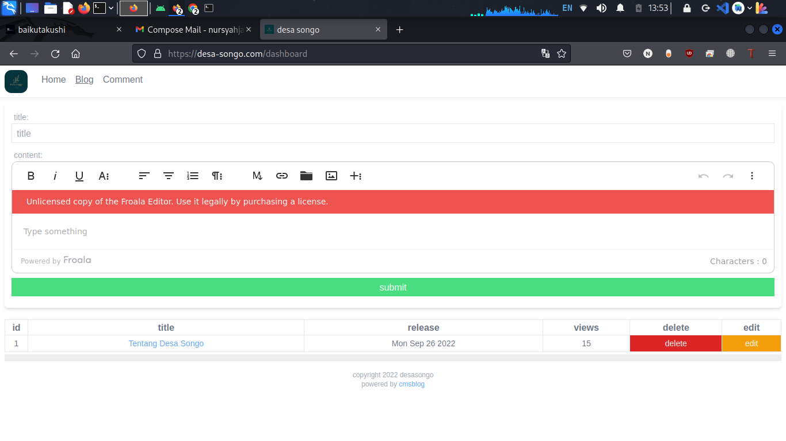
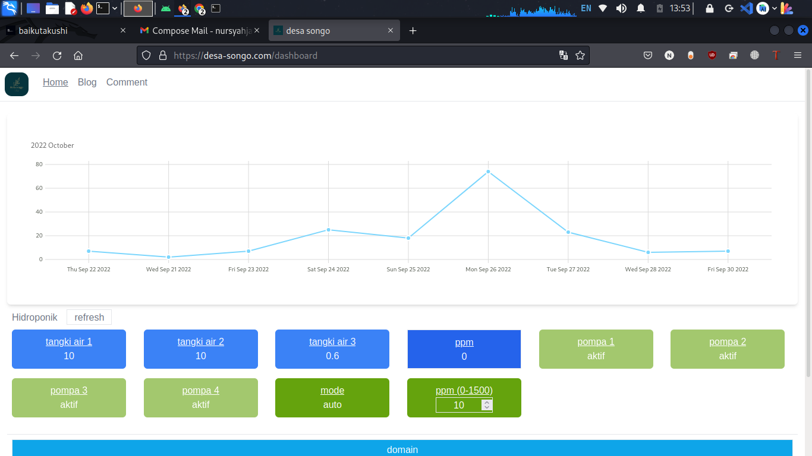

# web-monitor-hydroponics
web to monitor hydroponics using vue, supabase, typescript, python, arduino

## source code

- arduino program can be find in here [arduino_code/arduino](/arduino_code/arduino.ino)
- bash program can be find in here [statsnet.sh](/statsnet.sh)
- source code web can be find in folder [src](/src/)
- to edit dashboard edit [src/views/Dashboard.vue](/src/views/Dashboard.vue)
- to edit blog edit [src/views/Blog.vue](/src/views/Blog.vue)
- to edit home edit [src/components/Home.vue](/src/views/Home.vue)

## getting started
```
  git clone git@github.com:nursyah21/web-monitor-hydroponics.git
  npm --install
  npx vite
```

## tools
- to write program arduino you can use https://www.arduino.cc/en/software
- to see table erd you can use [vscode erd editor](https://marketplace.visualstudio.com/items?itemName=dineug.vuerd-vscode)

## screenshot

screenshot bash program to monitor usage bandwith data


screenshot programs to monitor stats hydroponics


screenshot web to see comments in dashboard


screenshot web to see index page


screenshot web to see and create post in dashboard


screenshot web to see stats web
